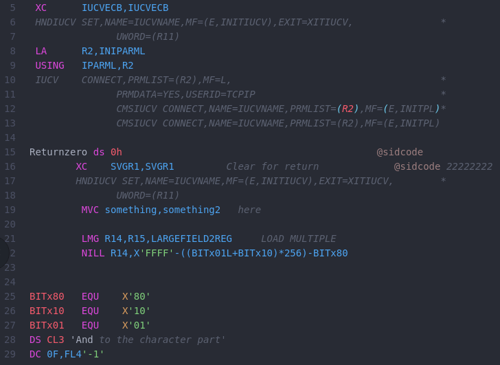
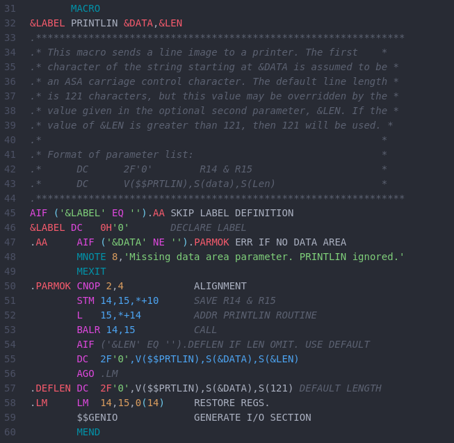

**NOTICE: This project is in [Emeritus status](https://tac.openmainframeproject.org/process/lifecycle.html#emeritus-stage) and no longer maintained**

# language-zvm-asm package

Atom editor package that adds language syntax highlighting for z/VM assembler language files as well as the PL/X grammar.

> Not every valid syntax is currently supported, but we're always open to net-improvements if you have a talent for regular expressions and the patience to cope with Atom's restrictions.

> The package currently uses [TextMate Grammar](https://macromates.com/manual/en/language_grammars) for Syntax Highlighting and plans on shifting to [Tree-Sitter Grammar](http://tree-sitter.github.io/tree-sitter/) in near future

### Sample Highlighting 1

### Sample Highlighting 2

#

### References:
1. [PL/X Language Reference](https://www.ibm.com/docs/en/SSY2V3_5.3.0/pg.pdf)
2. [HLSAM Language Reference](https://www.ibm.com/docs/en/hla-and-tf/1.6?topic=SSENW6_1.6.0/com.ibm.hlasm.v1r6.asm/asm.htm)
3. [ATOM grammars](https://flight-manual.atom.io/hacking-atom/sections/creating-a-grammar)
4. [Generating ATOM snippets](https://flight-manual.atom.io/using-atom/sections/snippets)
5. [TextMate 1.0 Mannual](https://macromates.com/manual/en/language_grammars)
#

* See the NOTICE file for copyrights.
* See the LICENSE file for license information.
